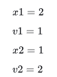
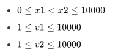
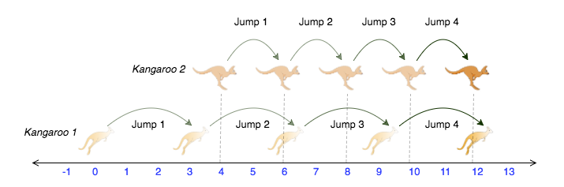

# Saltos na Linha Numérica

Você está coreografando um show de circo com vários animais. Para um dos atos, você tem dois cangurus em uma linha numérica prontos para saltar na direção positiva (ou seja, em direção ao infinito positivo).

O primeiro canguru começa na posição `x1` e se move a uma taxa de `v1` metros por salto.

O segundo canguru começa na posição `x2` e se move a uma taxa de `v2` metros por salto.

Você precisa descobrir uma maneira de fazer com que os dois cangurus cheguem ao mesmo local ao mesmo tempo como parte do show. Se for possível, retorne `SIM`, caso contrário, retorne `NÃO`.

## Exemplo



Após um salto, ambos estão na posição `(x, y)`, então a resposta é `SIM`.

### Descrição da Função

Complete a função `kangaroo` no editor abaixo.

**`kangaroo` possui os seguintes parâmetros:**

- `int x1, int v1`: posição inicial e distância de salto do canguru 1.
- `int x2, int v2`: posição inicial e distância de salto do canguru 2.

**Retorna:**

- `string`: `SIM` ou `NÃO`.

### Formato de Entrada

Uma única linha com quatro inteiros separados por espaço, representando respectivamente os valores de `x1`, `v1`, `x2` e `v2`.



### Restrições

---

### Exemplo de Entrada 0

```
0 3 4 2
```

### Exemplo de Saída 0

```
SIM
```

#### Explicação 0

Os dois cangurus pulam pela seguinte sequência de posições:



Na imagem, fica claro que os cangurus se encontram na mesma localização (número na linha numérica) após o mesmo número de saltos (saltos), então imprimimos `SIM`.

### Exemplo de Entrada 1

```
0 2 5 3
```

### Exemplo de Saída 1

```
NÃO
```

#### Explicação 1

O segundo canguru tem uma posição inicial que está à frente (mais à direita) da posição inicial do primeiro canguru (ou seja, `x2 > x1`). Como o segundo canguru se move a uma taxa mais rápida (`v2 > v1`) e já está à frente do primeiro canguru, o primeiro canguru nunca conseguirá alcançá-lo. Assim, imprimimos `NÃO`.
