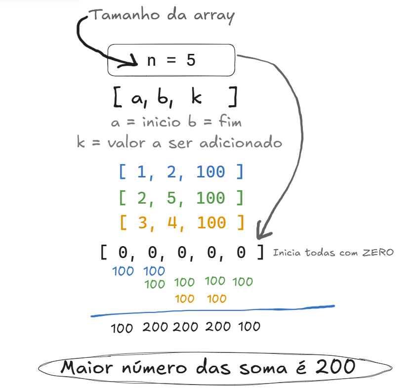

## Pq na primeira atualização fica [100 ,100 ,0, 0, 0]?

A confusão pode ser esclarecida entendendo como as operações afetam os elementos do array. Vou detalhar o processo passo a passo, considerando a abordagem convencional (atualizando diretamente os elementos do array dentro do intervalo) para a primeira atualização.

---

### **Primeira Operação: `[1, 2, 100]`**

Isso significa:

- Adicione `100` a **todos os elementos entre os índices 1 e 2**, inclusive.

**Array Inicial:**
\[0, 0, 0, 0, 0\]

Agora, atualizamos os valores nos índices 1 e 2:

- No índice 1: \(0 + 100 = 100\).
- No índice 2: \(0 + 100 = 100\).

**Array Após a Atualização:**
\[100, 100, 0, 0, 0\]

---

### Por que isso acontece?

A instrução diz para adicionar \(100\) apenas aos elementos **dentro do intervalo** `[1, 2]` (inclusive). Isso resulta no seguinte:

- Os índices **fora do intervalo** (`3`, `4`, `5`) não são alterados e permanecem como \(0\).

---

No exemplo dado, estamos visualizando o **array diretamente atualizado** com base nas operações. A solução eficiente que implementamos (usando diferença de arrays) alcança o mesmo resultado, mas de forma otimizada, aplicando as alterações apenas nos limites e calculando os valores acumulados depois.

