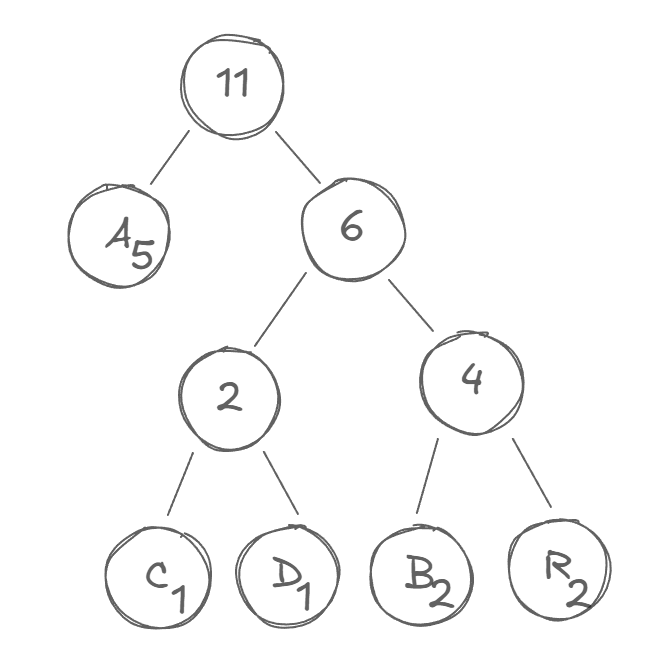
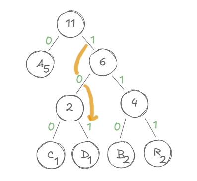

A **árvore de decodificação de Huffman** é uma estrutura de dados usada para comprimir informações de forma eficiente. Ela é baseada no conceito de **codificação de Huffman**, uma técnica amplamente utilizada em compressão de dados, como em arquivos ZIP e JPEG. Vamos entender o que é e como funciona:

---

## **O que é uma Árvore de Huffman?**

Uma **árvore de Huffman** é uma árvore binária onde:

1. Cada folha da árvore representa um símbolo (caractere ou byte).
2. Cada caminho da raiz até uma folha define o código binário correspondente ao símbolo.
3. Os símbolos mais frequentes têm códigos binários mais curtos, enquanto os menos frequentes têm códigos mais longos.

Essa propriedade faz a codificação ser **ótima**, reduzindo o tamanho total dos dados comprimidos.

---

## **Como Construir a Árvore de Huffman**

### 1. **Obtenha as Frequências**

Conte a frequência de cada símbolo nos dados que deseja comprimir.

**Exemplo**:
Para a string `ABRACADABRA`, temos:

```
A: 5, B: 2, R: 2, C: 1, D: 1
```

### 2. **Crie Nós para os Símbolos**

Crie um nó de árvore para cada símbolo e sua frequência.

**Exemplo**:
\[
\text{Nós iniciais: } \{A(5), B(2), R(2), C(1), D(1)\}
\]

### 3. **Combine os Nós Menores**

Combine os dois nós com menor frequência em um novo nó, cuja frequência é a soma das duas. Repita até que reste apenas um nó, que será a raiz.

**Exemplo de combinações**:

1. Combine \(C(1)\) e \(D(1)\) → Crie \(CD(2)\).
2. Combine \(B(2)\) e \(R(2)\) → Crie \(BR(4)\).
3. Combine \(CD(2)\) e \(BR(4)\) → Crie \(CD-BR(6)\).
4. Combine \(CD-BR(6)\) e \(A(5)\) → Crie a raiz \(A-CD-BR(11)\).

---

## **Exemplo de Árvore**

Após construir a árvore, ela pode ficar assim:

```
           [11]
         /     \
      [A(5)]   [6]
              /   \
           [2]   [4]
          /  \   /  \
     [C(1)] [D(1)][B]  [R]
```

### 4. **Atribua Códigos Binários**

Caminhe pela árvore:

- Vá para a esquerda → adicione `0`.
- Vá para a direita → adicione `1`.

Os códigos gerados:

```
A → 0
C → 100
D → 101
B → 110
R → 111
```

Agora, os dados podem ser comprimidos usando esses códigos binários.

---

## **Como Decodificar?**

Para decodificar, basta usar a árvore:

1. Leia os bits do código comprimido.
2. Navegue pela árvore (0 = esquerda, 1 = direita).
3. Quando alcançar uma folha, emita o símbolo.

**Exemplo**:
Com o código comprimido: `01101100` e a árvore acima:

- `0` → `A`
- `110` → `B`
- `110` → `B`
- Resultado: `ABB`.

---

## **Vantagens**

- Compressão sem perdas.
- Ótima para dados com distribuições desiguais de frequência.

## Dúvidas

Por que o [11] ?



O `[11]` representa a raiz da árvore de Huffman, e o número **11** é a soma total das frequências de todos os caracteres no conjunto de entrada. A árvore de Huffman funciona combinando as menores frequências recursivamente até formar um único nó raiz que contém a soma de todas as frequências.

### Cálculo:

Frequências dos caracteres:

- **A**: 5
- **R**: 2
- **B**: 2
- **C**: 1
- **D**: 1

Soma total:
\[ 5 + 2 + 2 + 1 + 1 = 11 \]

O `(11)` é criado como o nó raiz que representa toda a árvore, indicando que ela codifica 11 unidades (caracteres) no total.

```typescript
A B   R   A C   A D   A B   R   A
0 110 111 0 100 0 101 0 110 111 0
```



D = 101
