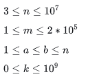

# Manipulação de Arrays

Partindo de um array indexado por 1 preenchido com zeros e uma lista de operações, para cada operação, adicione um valor a cada elemento do array entre dois índices dados, que a gente vai chamar de `inclusive`. Após todas as operações serem realizadas, retorne o maior valor no array.

## Exemplo

As consultas são interpretadas da seguinte forma:

```
    a b k
    1 5 3
    4 8 7
    6 9 1
```

Adicione os valores entre os índices `a` até o `b`:

```
índice ->  1  2  3   4   5  6  7  8  9  10
[0, 0, 0,  0,  0, 0, 0, 0, 0,  0]
[3, 3, 3,  3,  3, 0, 0, 0, 0,  0]
[3, 3, 3, 10, 10, 7, 7, 7, 0,  0]
[3, 3, 3, 10, 10, 8, 8, 8, 1,  0]
```

O maior valor é `10` após todas as operações serem realizadas.

---

## Descrição da Função

Sem descrição, Ver arquivo index.ts

### Parâmetros da função

- **`int n`** - o número de elementos no array.
- **`int queries[q][3]`** - um array bidimensional de consultas onde cada `queries[i]` contém três inteiros: `a`, `b` e `k`.

### Retorno

- **`int`** - o valor máximo no array resultante.

---

## Formato de Entrada

A primeira linha contém dois números inteiros separados por espaço, `n` (tamanho do array) e `m` (número de operações).

Cada uma das próximas `m` linhas contém três inteiros separados por espaço, `a`, `b` e `k` (índice inicial, índice final e valor a ser adicionado).

---

## Restrições



---

## Exemplo de Entrada

```
5 3
1 2 100
2 5 100
3 4 100
```

---

## Exemplo de Saída

```
200
```

---

## Explicação

Após a primeira atualização, o array é:

```
100 100 0 0 0
```

Após a segunda atualização, o array é:

```
100 200 100 100 100
```

Após a terceira atualização, o array é:

```
100 200 200 200 100
```

O maior valor é `200`.
