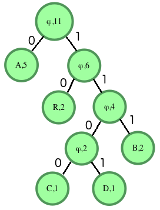

# Árvore: Decodificação de Huffman

A codificação de Huffman atribui códigos de comprimento variável aos caracteres de entrada de comprimento fixo com base em suas frequências. Caracteres mais frequentes recebem códigos mais curtos, enquanto caracteres menos frequentes recebem códigos mais longos. Todos os caminhos para um caractere contêm um dígito do código. Se o caminho estiver no lado esquerdo da árvore, será representado por 0 (zero). Se no lado direito, será representado por 1 (um). Somente as folhas conterão uma letra e sua contagem de frequência. Todos os outros nós conterão `null` em vez de um caractere e a soma das frequências de todos os seus descendentes.

Por exemplo, considere a string **ABRACADABRA**. Há um total de 11 caracteres na string. Esse número deve coincidir com a contagem no nó raiz da árvore final. As frequências são:

- A: 5
- B: 2
- R: 2
- C: 1
- D: 1

As duas menores frequências são de **C** e **D**, ambas iguais a 1. Assim, criamos uma árvore com elas. O nó raiz conterá a soma das contagens dos seus descendentes, neste caso, 2. O nó esquerdo será o primeiro caractere encontrado, **C**, e o nó direito conterá **D**. A seguir, temos três elementos com frequência 2: a árvore criada, o caractere **B** e o caractere **R**. A árvore vem primeiro, então será colocada à esquerda do novo nó raiz, e **B** será colocado à direita. Esse processo é repetido até que a árvore esteja completa, preenchendo os `0s` e `1s` para as arestas. O grafo final fica assim:



Os caracteres de entrada estão presentes apenas nas folhas. Nós internos têm um valor de caractere **ϕ (NULL)**. Podemos determinar que os valores para os caracteres são:

- **A**: 0
- **B**: 111
- **C**: 1100
- **D**: 1101
- **R**: 10

Nossa string codificada por Huffman é:

```
A   B    R  A  C     A  D     A   B    R   A
0  111  10  0  1100  0  1101  0  111  10  0
```

Ou:

```
01111001100011010111100
```

Para evitar ambiguidades, a codificação de Huffman é uma técnica de codificação livre de prefixos. Nenhum código aparece como prefixo de outro.

### Decodificação

Para decodificar a string codificada, siga os zeros e uns até uma folha e retorne o caractere encontrado.

### Descrição da Função

Complete a função `decode_huff` abaixo. Ela deve retornar a string decodificada.

**Parâmetros:**

- `root`: uma referência ao nó raiz da árvore de Huffman.
- `s`: uma string codificada por Huffman.

**Formato de Entrada**
Há uma linha de entrada contendo a string original, `s`. O código auxiliar cria a árvore de Huffman e passa o nó raiz e a string codificada para a função.

**Restrições**

- A string contém apenas caracteres presentes nas folhas da árvore.

**Formato de Saída**
Imprima a string decodificada em uma única linha.

### Exemplo de Entrada


```
s = "1001011"
```

### Exemplo de Saída

```
ABACA
```

### Explicação

Processando a string da esquerda para a direita:

1. **S[0]='1'**: mova para o filho direito da raiz. Encontre a folha com valor 'A'. Adicione 'A' à string decodificada. Volte para a raiz.
2. **S[1]='0'**: mova para o filho esquerdo.
3. **S[2]='0'**: mova para o filho esquerdo. Encontre a folha com valor 'B'. Adicione 'B' à string decodificada. Volte para a raiz.
4. **S[3]='1'**: mova para o filho direito da raiz. Encontre a folha com valor 'A'. Adicione 'A' à string decodificada. Volte para a raiz.
5. **S[4]='0'**: mova para o filho esquerdo.
6. **S[5]='1'**: mova para o filho direito. Encontre a folha com valor 'C'. Adicione 'C' à string decodificada. Volte para a raiz.
7. **S[6]='1'**: mova para o filho direito da raiz. Encontre a folha com valor 'A'. Adicione 'A' à string decodificada. Volte para a raiz.

**String Decodificada**: **"ABACA"**
